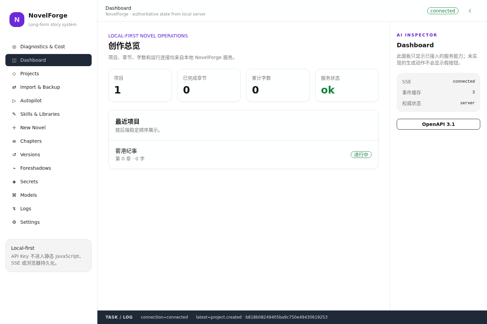
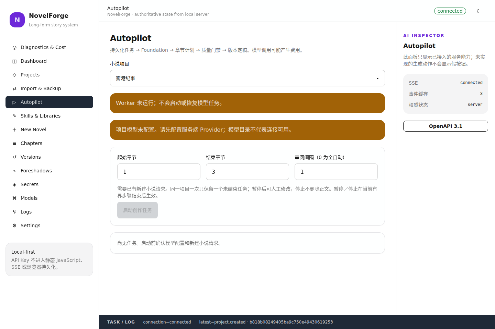
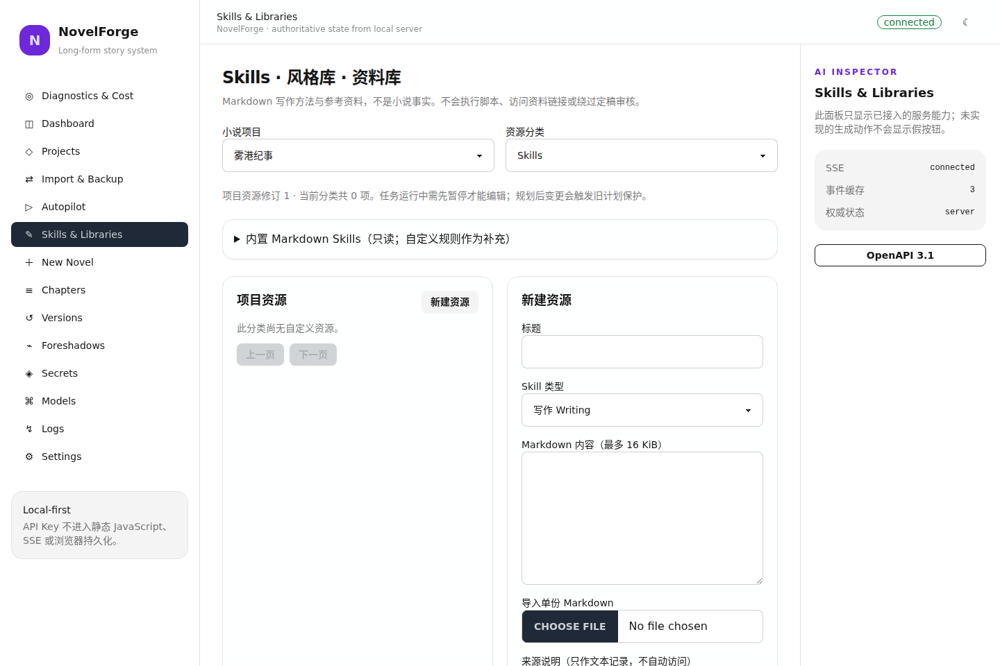
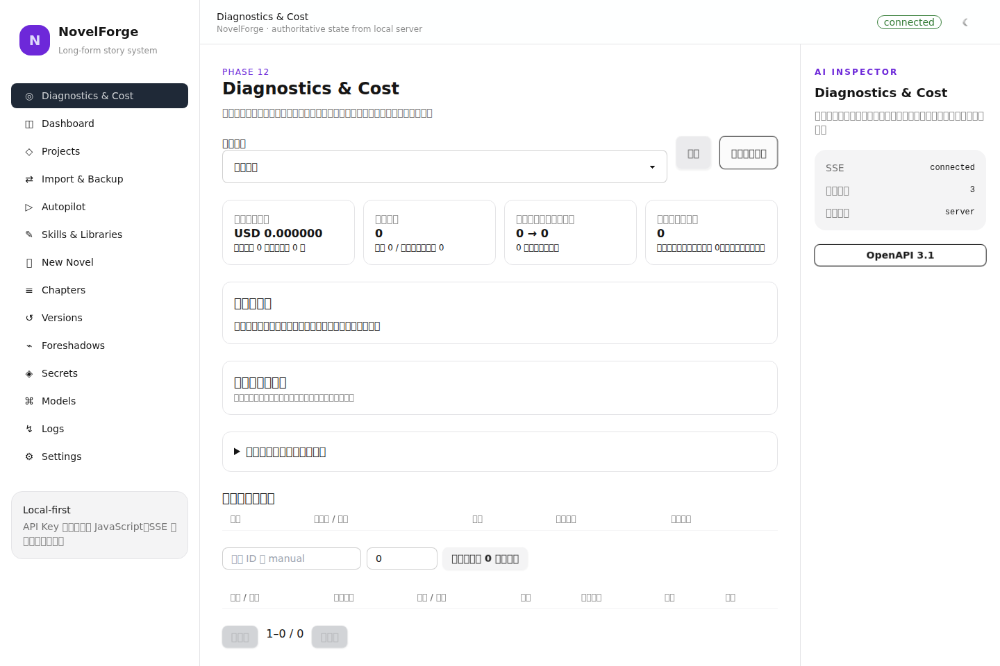
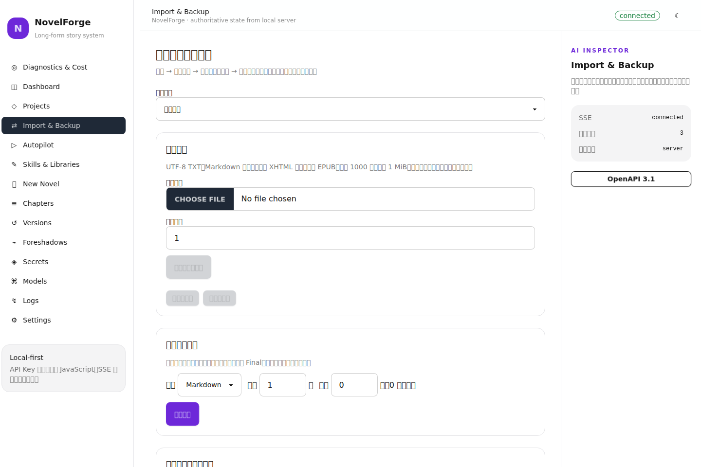
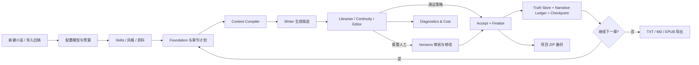

# NovelForge

> 面向长篇小说的本地优先 AI 创作与人机共创工作台：让事实有来源、改稿有版本、自动写作可暂停恢复，作品可以导入、导出、备份并持续维护。

[部署指南](docs/DEPLOYMENT.md) · [本地完整验收](docs/LOCAL_ACCEPTANCE.md) · [发布流程](docs/RELEASING.md) · [文档导航](docs/README.md) · [Roadmap](docs/ROADMAP.md)

## 当前状态

- **Phase 1–12 已进入主线功能。** Web 工作台、Truth Store、质量门禁、叙事账本、上下文编译、章节版本、可恢复 Autopilot、Skills/风格/资料库、作品生命周期以及诊断/成本管理均已接入实际运行路径。
- **Phase 13A 已交付。** 默认启动入口、分级验证工具、候选版打包与预发布流程已经落地。
- **可下载候选版：[`v0.1.0-rc.1`](https://github.com/feng123-new/NovelForge/releases/tag/v0.1.0-rc.1)。** 提供 Linux / macOS / Windows 的 amd64、arm64 六个包，以及 SHA-256、manifest 和验证摘要。
- **Phase 13B 仍待本地完整验收。** 当前没有宣称全量回归、所有目标平台运行、100/500/1000 章规模、真实付费模型账单或文学质量已经通过。

百万字长篇是设计目标，不是当前验证结论。候选版是 **prerelease**，不是稳定版或 `latest`。

## Web 工作台实机预览

下面的图片不是设计稿。它们由 2026-09-06 的限定 UI 审计直接启动当前嵌入式 Go Server，创建临时项目 **「雾港纪事」**，再用真实 Chrome 打开生产路由后截图；该审计没有配置或调用付费模型。

### 创作总览



<table>
<tr>
<td width="50%">
<strong>可恢复 Autopilot</strong><br/>

</td>
<td width="50%">
<strong>Skills · 风格库 · 资料库</strong><br/>

</td>
</tr>
<tr>
<td width="50%">
<strong>Diagnostics & Cost</strong><br/>

</td>
<td width="50%">
<strong>导入、导出与备份</strong><br/>

</td>
</tr>
</table>

### 前后端兼容性实际检查

本次 README 更新前额外跑了一轮针对 Web 的真实检查，而不是只确认页面源码存在：

- Svelte / TypeScript：**0 errors / 0 warnings**。
- Dashboard、Autopilot、Authoring、Diagnostics、Lifecycle：**5 个前端测试文件、9 个测试通过**。
- Vite production build 成功，生成的 `web/dist` 与仓库内嵌产物一致，生成 JavaScript 语法检查通过。
- `CGO_ENABLED=0` 构建真实 `novelforge` 可执行文件成功，并由该可执行文件启动实际 Web Server。
- Chrome 实际打开 **Dashboard / Autopilot / Skills & Libraries / Diagnostics & Cost / Import & Backup** 五条生产路由；五个页面都显示后端创建的同一测试项目和各自的后端加载标记。
- 浏览器会话中这五个页面的 **error alert = 0、browser exception = 0、HTTP 5xx = 0**。
- 审计没有执行模型生成，所以这只能证明上述页面与实际后端在无模型短流程中的兼容性；真实模型和完整规模验收仍属于 Phase 13B。

审计运行：GitHub Actions `34003983051`。早先一次审计因临时安装浏览器驱动触发 npm 自身错误，随后改为 Runner 自带 Chrome DevTools 协议；失败记录保留，没有通过删测试或忽略错误获得绿色结果。

## NovelForge 解决什么问题

很多 AI 写作流程可以生成文本，但长篇维护更难的是：**前面已经确认的事实怎么办、人物在当前章节究竟知道什么、作者亲自改稿后旧计划是否还有效、程序中断后从哪里继续、模型重试到底花了多少。**

NovelForge 的重点不是把一个 Prompt 包装成“自动写小说”，而是把这些状态做成可追踪的工程流程：

| 核心能力 | NovelForge 的处理方式 |
| --- | --- |
| **事实权威与时间边界** | Truth Store 保存不可变事件、来源、权威级别、冲突与 Chapter-N 投影；模型建议不会自动升级成权威事实。 |
| **人物知识边界** | Narrative Ledger 和 Context Compiler 按章节 / POV 选择秘密、伏笔和相关上下文，未知秘密只暴露“不可知边界”，不把真相泄漏给当前视角。 |
| **人工改稿** | Draft、修订、Check、Accept、Finalize 分离；人工版本不会直接覆盖历史，定稿后再更新权威事实与派生状态。 |
| **连续自动创作** | Autopilot 有持久化任务、暂停 / 停止 / 继续、有限重写、人工审阅点和重启恢复；下一章只沿已完成的定稿链推进。 |
| **上下文选择** | Context Compiler 对 Truth、Ledger、近期正文、FTS、Skills、风格和资料执行分层预算；必需约束无法容纳时停止，而不是静默丢掉后继续写。 |
| **写作方法与资料** | Writing / Review / Polish / Planning Markdown Skills；独立风格库、资料库、中文检索和可解释的表达/重复建议。 |
| **作品生命周期** | TXT / Markdown / 文本型 EPUB 导入，候选审核，TXT / Markdown / EPUB 定稿导出，以及 ZIP 项目备份、恢复与格式迁移。 |
| **成本与诊断** | 显式模型尝试、fallback、返回用量、价格快照、未知费用、缓存重放、预算和服务商冷却分别记录；诊断页给出可操作的停止原因。 |
| **本地优先** | SQLite + Go + 内嵌 Web；默认绑定回环地址，不要求 PostgreSQL、Redis 或外部向量数据库才能运行基本工作台。 |

## 一次完整的创作流程



推荐的日常操作顺序：

1. **先用独立测试工作区启动。** 第一次可以加 `--no-autopilot`，只关闭自动任务 Worker，先检查界面和项目数据；它不是全局只读模式。
2. **配置模型。** 给 Writer / Librarian / Editor 等角色指定 Provider 与模型，凭据使用环境变量引用，不提交到仓库。
3. **新建小说或导入已有作品。** 新建向导保存 Foundation 请求；导入旧稿先产生候选版本，不会因为上传文件就自动接受事实或启动付费分析。
4. **整理 Skills、风格与资料。** 在 **Skills & Libraries** 中设置写作方法、文风、参考资料、适用章节/POV 和表达重复规则。
5. **先设费用保护。** 在 **Diagnostics & Cost** 中配置模型单价、项目/任务预算、尝试次数和服务商暂停策略；未知费用不会被显示成 0。
6. **从 Autopilot 显式启动有限章节。** 设定起始章、目标章和人工审阅间隔。任务可以暂停、停止、继续，并保留已持久化结果和检查点。
7. **在 Versions 审阅。** 查看候选、质量检查和 Diff；必要时人工修订。只有经过 Accept + Finalize 的版本进入权威定稿链。
8. **持续检查事实、伏笔与诊断。** Truth / Ledger / Diagnostics 用于确认事实冲突、秘密边界、逾期伏笔、旧计划、重试和费用情况。
9. **定期导出和备份。** 只把提交完整且与章节文件同步的 Final 导出为成品；ZIP 备份用于迁移和恢复项目。

更详细的操作边界见 [Web 工作台](docs/WEB.md)、[Autopilot](docs/AUTOPILOT.md)、[Authoring](docs/AUTHORING.md)、[Lifecycle](docs/LIFECYCLE.md) 和 [Diagnostics](docs/DIAGNOSTICS.md)。

## 快速开始

### 方式一：下载 `v0.1.0-rc.1`

从 [GitHub Releases](https://github.com/feng123-new/NovelForge/releases/tag/v0.1.0-rc.1) 下载与你的系统 / 架构对应的压缩包，并使用同页的 `novelforge_checksums.txt` 核对 SHA-256。

解压后先在新的测试目录启动：

```sh
# Linux / macOS
./novelforge server --workspace ./workspace-test --no-autopilot
```

```powershell
# Windows PowerShell
.\novelforge.exe server --workspace .\workspace-test --no-autopilot
```

浏览器访问 `http://127.0.0.1:48090`。确认工作台正常后，按 [部署指南](docs/DEPLOYMENT.md) 配置模型并移除 `--no-autopilot` 启用正常任务 Worker。

> `v0.1.0-rc.1` 中 Linux amd64 做过原生无模型二进制烟测；其他平台包为交叉编译产物，仍需要在对应机器完成 Phase 13B 运行验收。

### 方式二：Docker Compose

仓库已经包含 `Dockerfile` 和 `docker-compose.yml`。当前可确认的 Docker 路径是**从源码本地构建**：

```sh
git clone https://github.com/feng123-new/NovelForge.git
cd NovelForge
mkdir -p config workspace
docker compose up -d --build
```

然后访问 `http://127.0.0.1:48090`。

Compose 默认：

```text
宿主机 127.0.0.1:48090  -> 容器 0.0.0.0:48090
./config                  -> /root/.novelforge
./workspace               -> /workspace
```

`docker-compose.yml` 中保留了镜像名，但本 README **不把 `ghcr.io/...:latest` 当作已经验证的正式镜像发行渠道**；需要确定性部署时使用 `docker compose up -d --build`。远程访问不要直接把端口暴露到公网，当前服务没有完整的多用户认证层。

### 方式三：从源码构建

需要 `go.mod` 声明的 Go 版本（当前为 Go 1.25.5）：

```sh
git clone https://github.com/feng123-new/NovelForge.git
cd NovelForge
CGO_ENABLED=0 go build -trimpath -o novelforge ./cmd/novelforge
./novelforge server --workspace ./workspace-test --no-autopilot
```

原有 TUI / Headless 兼容入口仍保留：

```sh
./novelforge
./novelforge --headless --prompt-file prompt.txt
```

## 模型配置

Web Server 支持显式配置、项目级配置和全局配置。建议把真实密钥放到环境变量：

```json
{
  "provider": "local-proxy",
  "model": "your-model",
  "providers": {
    "local-proxy": {
      "type": "openai",
      "api": "chat",
      "api_key": "${NOVELFORGE_API_KEY}",
      "base_url": "https://your-provider.example/v1"
    }
  },
  "roles": {
    "writer": {"provider": "local-proxy", "model": "your-model"},
    "librarian": {"provider": "local-proxy", "model": "your-model"},
    "editor": {"provider": "local-proxy", "model": "your-model"}
  }
}
```

```sh
export NOVELFORGE_API_KEY='...'
./novelforge server --workspace ./workspace-test --config /secure/novelforge.json
```

配置选择优先级：

```text
server --config / 顶层 CLI --config
NOVELFORGE_CONFIG
<项目>/.novelforge/config.json
<项目>/.ainovel/config.json
~/.novelforge/config.json
~/.ainovel/config.json
built-in defaults
```

同一层的新旧配置不会合并；显式配置独立使用。Web 中显示“模型可用”表示满足配置条件，不等于已经通过实际 Provider 联网健康检查。模型请求可能把被选中的小说上下文发送给你配置的 Provider，因此“本地优先”不等于“所有内容永远不离开本机”。

## Web 页面地图

| 页面 | 主要用途 |
| --- | --- |
| **Dashboard** | 项目、章节、字数、状态和最近操作总览 |
| **Projects / New Novel** | 项目生命周期与 Foundation 请求 |
| **Autopilot** | 启动有限章节任务、暂停 / 继续 / 停止、查看候选与人工审阅点 |
| **Chapters / Versions** | 章节阅读、候选版本、Diff、人工修订、Check / Accept / Finalize |
| **Skills & Libraries** | Writing / Review / Polish / Planning Skills、风格库、资料库、表达与重复规则 |
| **Foreshadows / Secrets** | 伏笔生命周期、预期回收窗口、秘密持有人和 POV 知识边界 |
| **Diagnostics & Cost** | 模型尝试、用量、费用、预算、fallback / provider 状态及可操作诊断 |
| **Import & Backup** | TXT / MD / EPUB 导入、定稿导出、ZIP 备份恢复和项目格式迁移 |
| **Models / Logs / Settings** | 配置状态、结构化运行信息与工作台设置 |

## 数据与一致性边界

工作区控制数据位于 `.novelforge/server.db`，小说权威数据位于每个项目的 `.novelforge/project.db`。业务写 API 使用 `Idempotency-Key`，集合查询有界分页，完整接口以 `/api/openapi.json` 为准。

一章正文从“生成出来”到“成为项目事实”需要经过不同层次：

```text
模型输出 / 导入原文
        ↓
候选 Version
        ↓
Librarian + Continuity + Editor / 人工检查
        ↓
Accept
        ↓
Finalize
        ↓
Active Final + Truth + Ledger + 正文文件 + Checkpoint
```

Writer / Librarian 不直接写入 Truth；严重一致性失败不能被文学评分抵消。人工保存或恢复创建新版本，而不是就地覆盖历史。旧计划依赖的事实或资料变化后，系统会阻止继续沿用过期状态，而不是假装已经完成。

## 诊断与费用的准确含义

Phase 12 记录新 Web / Autopilot 显式 SDK Generate 边界中的主模型与 fallback 尝试、返回 Token、用户配置价格快照、未知费用、缓存重放和任务关联。预算是在下一次请求前执行的本地保护，不是第三方服务商的绝对账单上限。

当前不会宣称完整计量旧 TUI、流式路径、外部 SDK 或 Provider 内部隐藏重试；缓存 Token、推理 Token 等特殊计费也不会在缺少明确数据时凭空推算。需要最终账单时仍以服务商记录为准。

## 验证分层

仓库不再把“快速迭代”和“完整验收”混成同一个概念：

```sh
python scripts/verify.py --mode doctor
python scripts/verify.py --mode quick
python scripts/verify.py --mode full
python scripts/verify.py --mode recovery
python scripts/verify.py --mode scale
```

- **quick**：PR / main 的限定检查，覆盖入口构建、关键短流程、接口契约和前端生产构建。
- **full**：保留原有完整 Go / 前端 / race 等回归入口，适合本地正式验收。
- **recovery**：集中验证中断恢复、版本提交、导入与数据恢复边界。
- **scale**：100 / 500 / 1000 章的合成工程规模入口，不等于真实模型生成同等篇幅。
- **真实模型与文学质量**：由 [LOCAL_ACCEPTANCE.md](docs/LOCAL_ACCEPTANCE.md) 单独安排，明确模型、预算、样本和人工评价，不把工程测试冒充文学质量证明。

验证脚本默认使用独立测试环境，不会因为运行 `full` / `scale` 就自动读取个人密钥并大量调用付费模型。

## 已知边界

- 当前公开版本是 **`v0.1.0-rc.1` 候选版**，Phase 13B 尚未完成。
- 百万字、1000 章以及所有平台稳定运行尚未形成正式验收结论。
- EPUB 当前以文本作品生命周期为主，不保证复杂图片、字体、排版或 DRM 保真。
- 项目备份包含小说正文、版本、事实和资料，**不是脱敏分享包**；凭据和工作区任务不会随项目备份恢复。
- 本地服务默认绑定回环地址；当前没有为公网多用户部署提供完整认证方案。
- 成本显示是依据记录和用户价格表的工程估算，不是第三方账单证明。

## 文档

- [Architecture](docs/ARCHITECTURE.md) — 当前系统架构
- [Web](docs/WEB.md) — Web Server 与工作台
- [Truth Store](docs/TRUTH_STORE.md) — 事实事件与时间投影
- [Quality Gate](docs/QUALITY_GATE.md) — 语义检查与质量门禁
- [Narrative Ledger](docs/NARRATIVE_LEDGER.md) — 伏笔与秘密边界
- [Context Compiler](docs/CONTEXT_COMPILER.md) — 上下文选择与预算
- [Chapter Versions](docs/CHAPTER_VERSION.md) — 章节版本与定稿
- [Autopilot](docs/AUTOPILOT.md) — 可恢复连续创作
- [Authoring systems](docs/AUTHORING.md) — Skills、风格、资料和规则
- [Lifecycle](docs/LIFECYCLE.md) — 导入、导出、备份与恢复
- [Diagnostics](docs/DIAGNOSTICS.md) — 调用、费用、预算和诊断
- [Deployment](docs/DEPLOYMENT.md) — 本地部署与升级回滚
- [Local acceptance](docs/LOCAL_ACCEPTANCE.md) — Phase 13B 本地完整验收
- [Roadmap](docs/ROADMAP.md) — 阶段状态和验证边界
- [Historical archive](docs/archive/README.md) — 历史交付证据

## License and credits

NovelForge 基于 Apache-2.0 上游 [`voocel/ainovel-cli`](https://github.com/voocel/ainovel-cli)，保留原始版权和来源。详见 [LICENSE](LICENSE)、[THIRD_PARTY_NOTICES.md](THIRD_PARTY_NOTICES.md)、[UPSTREAM_BASE.md](UPSTREAM_BASE.md) 和 [docs/LICENSES.md](docs/LICENSES.md)。

- **voocel/ainovel-cli** — Apache-2.0，核心代码与运行时上游。
- **Nigh/show-me-the-story** — MIT，体验与部署设计参考。
- **Hurricane0698/novelwriter** — AGPL-3.0，clean-room 架构参考，不复制源码。
- **EthanYoQ/AI-Novel-Writer** — GPL-3.0，clean-room 工作流参考，不复制源码。
